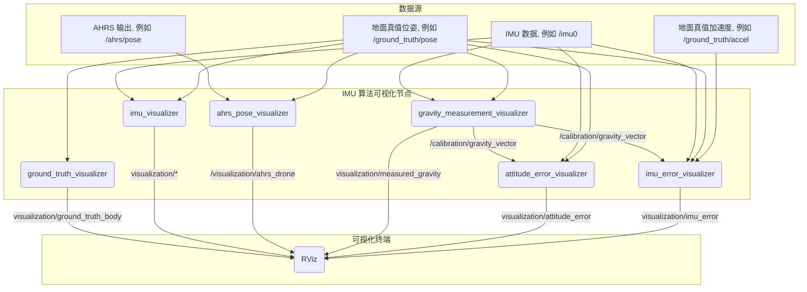

<div align="right">
  <a href="./Readme.md">English</a>
</div>

# IMU 算法可视化工具

[](https://opensource.org/licenses/MIT)

一个专为在Rviz中可视化各种IMU（惯性测量单元）属性、误差和算法输出而设计的ROS软件包。此工具可帮助分析和调试姿态估计算法及IMU传感器数据。

## 🚀 功能特性

-   可视化地面真值和估计位姿。
-   显示IMU测量向量（重力、加速度）。
-   量化并可视化姿态和测量误差。
-   提供用于重力标定和数据模拟的节点。
-   可通过ROS参数和启动文件进行高度配置。

## 🌊 工作流程
此图表展示了 `IMUAlgorithmVisualization` 软件包中不同节点之间的数据流。



## 📦 安装与使用

1.  **先决条件**:
    *   ROS (已在 Melodic & Noetic 上测试)
    *   一个 Catkin 工作空间

2.  **编译**:
    ```bash
    # 导航到您的catkin工作空间的src目录
    cd /path/to/your/catkin_ws/src

    # 克隆本仓库
    git clone https://github.com/InertialSensingAndAdvancedNavigationLab/IMUAlgorithmVisualization.git

    # 编译软件包
    cd ..
    catkin_make
    ```

3.  **运行**:
    该软件包附带了几个用于不同场景的启动文件。主启动文件是：
    ```bash
    roslaunch imu_algorithm_visualization run_visualization.launch
    ```
    您也可以运行单个节点或使用 `launch/` 目录中的其他启动文件进行特定分析。

## 📊 节点清单

以下是此软件包中提供的节点的详细列表。

---

### 1. 地面真值可视化 (Ground Truth Visualizer)

| 项目 | 描述 |
| :--- | :--- |
| **节点名称** | `ground_truth_visualizer_node` |
| **功能描述** | 将地面真值位姿可视化为一个精细的无人机模型。允许为特定测试场景锁定位置或姿态，并执行从URF到FLU的坐标系校正。 |
| **订阅** | `~ground_truth_pose_topic` (`/ground_truth/pose`, `geometry_msgs/PoseStamped`) |
| **发布** | `visualization/ground_truth_body` (`visualization_msgs/Marker`) (Latched) |
| **服务** | `set_attitude`, `set_location`, `reset_pose` |
| **TF** | 发布 `world` -> `ground_truth_body` 坐标变换。 |

---

### 2. IMU 可视化 (IMU Visualizer)

| 项目 | 描述 |
| :--- | :--- |
| **节点名称** | `imu_visualizer_node` |
| **功能描述** | 在地面真值的背景下可视化原始IMU数据。它显示无人机的轨迹、模型、真实姿态向量以及加速度计测量的不确定性。 |
| **订阅** | `~imu_topic` (`/imu0`, `sensor_msgs/Imu`) <br> `~ground_truth_pose_topic` (`/ground_truth/pose`, `geometry_msgs/PoseStamped`) |
| **发布** | `visualization/trajectory` (`visualization_msgs/Marker`) <br> `visualization/drone_model` (`visualization_msgs/Marker`) <br> `visualization/true_attitude` (`visualization_msgs/Marker`) <br> `visualization/accel_uncertainty` (`visualization_msgs/Marker`) |

---

### 3. AHRS 位姿可视化 (AHRS Pose Visualizer)

| 项目 | 描述 |
| :--- | :--- |
| **节点名称** | `ahrs_pose_visualizer` |
| **功能描述** | 可视化AHRS（姿态航向参考系统）算法的输出。它显示一个蓝色的无人机模型，其方向由AHRS数据控制，但其位置跟随地面真值。 |
| **订阅** | `~pose_topic` (`/ahrs/pose`, `geometry_msgs/PoseStamped`) <br> `/ground_truth/pose` (`geometry_msgs/PoseStamped`) |
| **发布** | `~model_topic` (`/visualization/ahrs_drone`, `visualization_msgs/Marker`) |
| **TF** | 发布 `world` -> `ahrs_body` 坐标变换。 |

---

### 4. 重力测量可视化 (Gravity Measurement Visualizer)

| 项目 | 描述 |
| :--- | :--- |
| **节点名称** | `gravity_measurement_visualizer_node` |
| **功能描述** | 可视化IMU测量的重力向量，并提供一个服务来校准它。校准后的向量被发布以供其他节点使用。 |
| **订阅** | `~imu_topic` (`/imu0`, `sensor_msgs/Imu`) <br> `~ground_truth_pose_topic` (`/ground_truth/pose`, `geometry_msgs/PoseStamped`) |
| **发布** | `visualization/measured_gravity` (`visualization_msgs/Marker`) <br> `/calibration/gravity_vector` (`geometry_msgs/Vector3Stamped`) (Latched) |
| **服务** | `/calibrate_gravity` (`std_srvs/Trigger`) |

---

### 5. 姿态误差可视化 (Attitude Error Visualizer)

| 项目 | 描述 |
| :--- | :--- |
| **节点名称** | `attitude_error_visualizer` |
| **功能描述** | 在机体坐标系中可视化真实重力向量与IMU测量的重力向量之间的误差。 |
| **订阅** | `/imu0` (`sensor_msgs/Imu`) <br> `/ground_truth/pose` (`geometry_msgs/PoseStamped`) <br> `/calibration/gravity_vector` (`geometry_msgs/Vector3Stamped`) |
| **发布** | `visualization/attitude_error` (`visualization_msgs/MarkerArray`) |
| **TF** | 监听从IMU坐标系到 `ground_truth_body` 坐标系的变换。 |

---

### 6. IMU 误差可视化 (IMU Error Visualizer)

| 项目 | 描述 |
| :--- | :--- |
| **节点名称** | `imu_error_visualizer` |
| **功能描述** | 通过将实际IMU读数与基于地面真值运动和重力计算出的理想读数进行比较，来计算并可视化总的IMU测量误差。使用时间同步器以保证高精度。 |
| **订阅 (同步)** | `/ground_truth/pose` (`geometry_msgs/PoseStamped`) <br> `/ground_truth/accel` (`geometry_msgs/AccelStamped`) <br> `/imu0` (`sensor_msgs/Imu`) |
| **订阅 (普通)** | `/calibration/gravity_vector` (`geometry_msgs/Vector3Stamped`) |
| **发布** | `visualization/imu_error` (`visualization_msgs/Marker`) |

---

### 7. 模拟IMU发布器 (Dummy IMU Publisher)

| 项目 | 描述 |
| :--- | :--- |
| **节点名称** | `dummy_imu_publisher` |
| **功能描述** | 一个用于测试的简单节点。它以50Hz的频率发布模拟的IMU数据，无需任何输入。 |
| **发布** | `/imu/data` (`sensor_msgs/Imu`) |

## 📜 许可证

该项目根据 MIT 许可证授权 - 详情请参阅 [LICENSE](LICENSE) 文件。